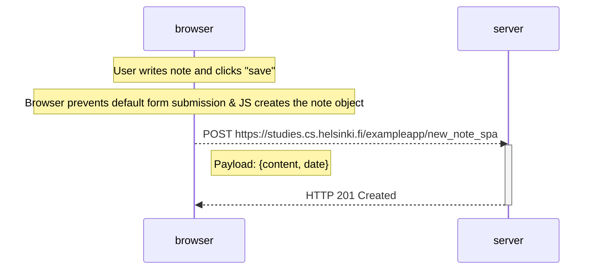

```mermaid
sequenceDiagram
  participant browser
  participant server

  Note over browser: User writes note and clicks "save"
  Note over browser: Browser prevents default form submission & JS creates the note object

  browser-->>server: POST https://studies.cs.helsinki.fi/exampleapp/new_note_spa
  activate server
  Note right of browser: Payload: {content, date}
  server-->>browser: HTTP 201 Created
  deactivate server
```
